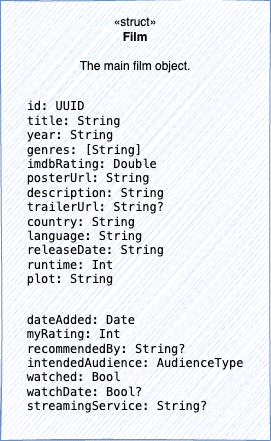
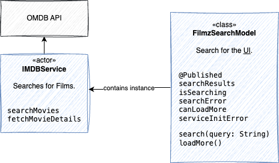

# Filmz

Maintaining my films and series. The ones I saw as well as the ones I want to see.

Data that I want to keep for a film:
* Title
* Year
* Genre (potentially multiple can apply)
* Rating (1-10) of ME
* Rating (1-10) of IMDB
* Poster (link to URL of IMDB)
* Description (from IMDB, maybe edited by me)
* Trailer (link to IMDB Trailer)
* Country (from IMDB maybe edited by me)
* Language (from IMDB maybe edited by me)
* Release Date (from IMDB)
* Runtime (from IMDB)
* Plot (from IMDB maybe edited by me)

Around sharing
* Who recommended me this film
* For who is this film. I.e. "Me alone", "Me and partner", "Family"

Functionality:
* Search, add, edit, delete a film
* Share a film

## Setup / Run / Build 

In order to **build and publish** a package go on `Product > Archive` and then `Distribute App`.
To *distribute* it the App I currently use TestFlight. Use [App Store Connect](https://appstoreconnect.apple.com) to upload the app and see what has been uploaded in the past.

To **build from the command line** run `Scripts/build.sh`.

To **set the icons**, make to have one png in 1024x1024 and then run `./Scripts/generate_app_icons.sh ./Logo/original_icon.png`.

To make nice **screenshots**, this is my process:
* Run the app from Xcode in the simulator (iPhone or iPad)
* Use the Screenshot button at the bottom right of the simulator
* Then make the screenshots in 3D with [Previewed](https://previewed.app/)

To create a **Privacy Policy** or to update it, I used [freeprivacypolicy.com](https://www.freeprivacypolicy.com/live/71c56b38-c4cf-4f25-b4c0-fc0920dfb53a).

Switching on/off **debug** is needed because some features are _hidden_ behind the debug flag (notably the cache Viewer). To switch it on/off go to `Filmz > Filmz > FilmzApp.swift` and change the `debug` variable.

## Roadmap

WIP-tracker:

* make the click on add work
* Pass the FilmStore as environment variable to the views
* Pass around just ImdbFilmId's and the MyFilmStore, all components retrieve it from there.
* Pass a delay to fetchMovieDetails for testing placeholder pictures
* When editing data of a MyFilm it doesn't save
* Complete basic fanctionality
* Use CloudKit Cache for IMDB data
* Extract Genre selector from FilmListView

Features in no specific order:

* Add MY RATING next to the OMDB Rating
* Share a movie with a friend.
* Replace the logo with `Image(systemName: "film.stack")` and maybe `breath`  animation.
* * Modify `IMDBService.featchMovieDetails` to return a `Film` object.
* Modify `IMDBService.featchMovieDetails` to first check in an iCloud Film cache

Technical playgrounds & toys on my list:

* Use Windsurf in order to compare it to cursor ai
* use Google AI Studio to work on the website

## Done

* 2025-02-16 Replace my image cache with [Kingfisher](https://github.com/onevcat/Kingfisher).
* 2025-02 Cache the movie pictures in order to speed up the app.

## Prompt snippets

### Project description 

Filmz is an app that helps you to maintain your films and series. The ones you saw as well as the ones you want to see. You can add, edit, delete a film and share it with friends. The app is built with SwiftUI and uses iCloudKit to store the data.

The key models are:

* MyFilm: Contains the data about a film that I maintain. Some fields of it:
  * id: UUID
  * imdbFilmId: The film id from IMDB
  * myRating: Int 0..10
  * dateAdded: Date
  * watched: Bool
  * dateWatched: Date
  * audience: Enum AudienceType("Me alone", "Me and partner", "Family")
  * recommendedBy: String
* ImdbFilm: Contains the data from IMDB about a film.
  * imdbId: String
  * title: String
  * year: String
  * genres: [String]
  * imdbRating: Double
  * poster: URL
  * plot: String

The main user flows are:

* User open the app and sees a list of his films (i.e. MyFilm entries).
* User can add a new film to the list: He can search for a film by title and then add it to his list. This is also where he enters his data about the film.
* User can see & edit the details of a film: He can see the details of a film from his list. This includes the data he entered as well as the data from IMDB.

Some key services & protocols I have:

* ImdbFilmService: Fetches the data from IMDB about a film.
  * searchFilms(query: String)  
  * fetchMovieDetails(imdbId: String) -> ImdbFilm
* MyFilmRepository: A protocol with basic functions:
  * fetchAllMyFilms()
  * addMyFilm(myFilm: MyFilm)
  * updateMyFilm(myFilm: MyFilm)
  * deleteMyFilm(myFilm: MyFilm)
* CKMyFilmRepository: A concrete implementation of MyFilmRepository that uses iCloudKit to store the data.
* MyFilmStore: A class that manages the data in the app. It uses CKMyFilmRepository to store the data.

The basic views that make up my app are:

* MyFilmListView: Shows a list of films. It uses MyFilmStore to fetch the data.
* MyFilmDetailView: Shows the details of a film. 
* ImdbFilmDetailView: Shows the details of a film from IMDB. It uses ImdbFilmService to fetch the data.

## Filmz structure

The Film class contains both data from IMDB as well as my own data about it:



## Storing Filmz

In order to store filmz in iCloudKit and to maintain them in the app, these are the involved classes:


## Searching Filmz

We have one class in charge of searching:



### Retrieving from OMDB

Since I use the [Open Movie Database API](https://www.omdbapi.com/), here are some test search requests:

```bash
curl -X GET "http://www.omdbapi.com/?apikey=1b5a29bf&s=batman" -H  "accept: application/json"
```

A sample result:
```json
{"Title":"Batman Begins",
"Year":"2005",
"Rated":"PG-13",
"Released":"15 Jun 2005",
"Runtime":"140 min",
"Genre":"Action, Drama",
"Director":"Christopher Nolan",
"Writer":"Bob Kane, David S. Goyer, Christopher Nolan","Actors":"Christian Bale, Michael Caine, Ken Watanabe",
"Plot":"When his parents are killed, billionaire playboy Bruce Wayne relocates to Asia, where he is mentored by Henri Ducard and Ra's Al Ghul in how to fight evil. When learning about the plan to wipe out evil in Gotham City by Ducard, Bruce prevents this plan from getting any further and heads back to his home. Back in his original surroundings, Bruce adopts the image of a bat to strike fear into the criminals and the corrupt as the icon known as \"Batman\". But it doesn't stay quiet for long.",
"Language":"English, Mandarin",
"Country":"United States, United Kingdom",
"Awards":"Nominated for 1 Oscar. 15 wins & 79 nominations total","Poster":"https://m.media-amazon.com/images/M/MV5BODIyMDdhNTgtNDlmOC00MjUxLWE2NDItODA5MTdkNzY3ZTdhXkEyXkFqcGc@._V1_SX300.jpg",
"Ratings":[{"Source":"Internet Movie Database","Value":"8.2/10"},{"Source":"Rotten Tomatoes","Value":"85%"},{"Source":"Metacritic","Value":"70/100"}],
"Metascore":"70",
"imdbRating":"8.2",
"imdbVotes":"1,626,251",
"imdbID":"tt0372784",
"Type":"movie",
"DVD":"N/A",
"BoxOffice":"$206,863,479",
"Production":"N/A",
"Website":"N/A",
"Response":"True"}
```

### Movie databases 

I need a movie database to query in the background. Here are some options I found:

* [Open Movie Database API](https://www.omdbapi.com/): I think it's a download of the [Open Movie Database](https://www.omdb.org/) (OMDB) and makes the content available via API. Free, but limited to 1000 requests per day. 
* [The Movie Database](https://www.themoviedb.org/): To get a commercial license I need to email them.
* ~~[IMDB](https://www.imdb.com/): The API is crazyyy expensive ($150,000 plus metered costs 😀)~~

Other services to look at:

* [Rotten Tomatoes](https://www.rottentomatoes.com/)
* [Metacritic](https://www.metacritic.com/)
* [Letterboxd](https://letterboxd.com/)
* [Flixster](https://www.flixster.com/)
* [JustWatch](https://www.justwatch.com/)
* [Filmweb](https://www.filmweb.pl/)
* [Film-Rezensionen](https://www.film-rezensionen.de/)